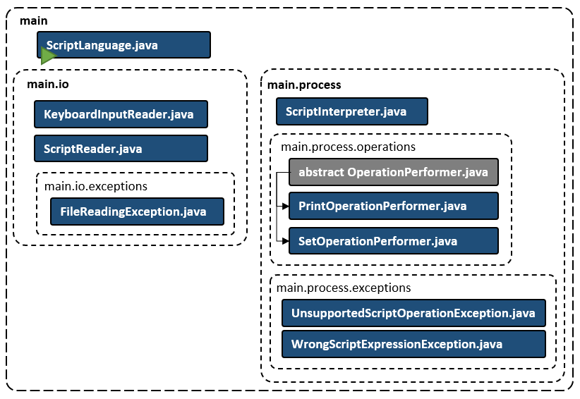

# Script Language Interpreter
### Project description
This Java console app is a script language interpreter that interprets and executes a script written on a custom script language.

### Purpose
The project is made to practice Java Collections, I/O, and other Java SE standard package features.

### Key feature description
The script is loaded from a text file (.txt) and **_executed line by line_**. The name of the file to be loaded is passed either as a command line argument or entered by the user from the keyboard (if there is no argument provided).
The **key features** are:
- perform calculations using whole numbers
- save numbers or calculation results in user-defined variables
- use variables in calculations (resolving variables into numbers stored in the variables)
- print text strings or values of user-defined variables on the screen
- use script documenting comments that are ignored by the script interpreter
- check the script and print errors with the problem description

#### Calculation operations
Calculations are performed in whole numbers. The following operations can be performed:
- addition
- subtraction
- multiplication
- division

The expression for evaluation can contain **opening `(` and closing `)` brackets** to determine the order of operations.

#### Script operators
The user script should contain the following operators (each one on a separate line):
- `set` operator calculates the given expression and assigns result to the named variable. The variable name must start with “`$`” and can include Latin letters, numbers and underscore mark only. The expression must be a number, other variable or must consist of numbers, other variable(s) and calculation operations named above
- `print` operator prints the specified list of strings and variables to the screen: strings and variables in the list are separated by commas; strings are enclosed in double quotes
- `#` operator determines a comment. Any line that starts with `#` will be ignored
- blank lines are ignored

### Usage example
The demo script file can be found in the root directory of the project (**DemoScript.txt**). It contains the following script.
```
# Printing some string
print "Hi, Alexey!"

# Performing "set" operations
set $n1 = 21
set $n2 = 121
set $sum = ($n1 - ($n2 - 42)) * (4 - 42 / $n1)

# Printing the script
print
print "You entered this script:"
print "set $n1 = ", $n1
print "set $n2 = ", $n2
print "$sum = ", "($n1 - ($n2 - 42)) * (4 - 42 / $n1) = ", $sum
```
The user passes the file name as a command line argument when launching the jar-file, or enters it from the keyboard after the corresponding request from the program (if the argument was not entered). The program displays the following result on the screen:
```
Hi, Alexey!

You entered this script:
set $n1 = 21
set $n2 = 121
$sum = ($n1 - ($n2 - 42)) * (4 - 42 / $n1) = -116

[ScriptLanguage] Program finished running. Press Enter to finish...
```
After the user presses Enter, the program will exit.
### Project structure
This is a simple Ant-based Java application. The diagram of modules and classes is shown in the figure below.



- `main` package contains `ScriptLanguage.java` class which is the main Application class. It addresses to the classes of the underlying packages (to read and interpret a script) and handles the incoming exceptions
  - `main.io` package contains classes that read external data from different sources
    - `KeyboardInputReader.java` class reads user keyboard input (e.g., when user inputs script file name)
    - `ScriptReader.java` class reads script file for further script interpretation / execution
    - `main.io.exceptions` package contains custom exception class (`FileReadingException.java`) that is used to throw exceptions connected with I/O operations
  - `main.process` package contains classes for the script interpretation which includes script parsing and validation, as well as performing related calculations and processing
    - `ScriptInterpreter.java` class is designed to interpret the script and return the final result. It addresses to other classes contained in the sub-packages of `main.process` package to perform the job.
    - `main.process.operations` package contains classes each one of which performs a separate script operation
      - `OperationPeformer.java` is an abstract class that represents performance of an abstract operation
      - `PrintOperationPerformer.java` class extends `OperationPeformer.java` class. It is designed to perform `print` script operation
      - `SetOperationPerformer.java` class extends `OperationPeformer.java` class. It is designed to perform `set` script operation
    - `main.process.exceptions` package contains custom exception classes (`UnsupportedScriptOperationException.java`, `WrongScriptExpressionExeption.java`) that are used to throw exceptions connected with the script interpretation and execution
